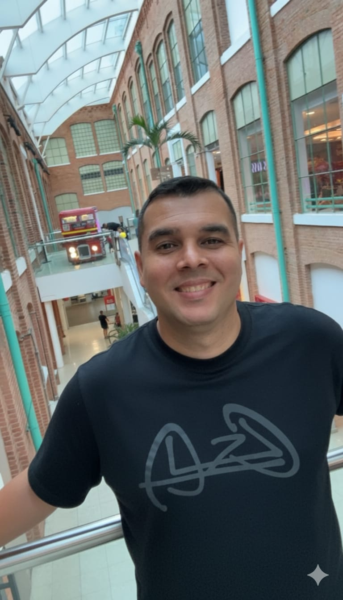

# 👋 Olá, eu sou Roberto Fernandes

<div align="center">
  
</div>

<div align="center">
  
[](https://rfernandes10.github.io/portfolio/)
[](https://www.linkedin.com/in/roberto-wolowitz/)
[](https://github.com/RFernandes10)
[](mailto:robertofernandes144@gmail.com)

</div>

---

## 🚀 Sobre o Projeto

Este é meu portfólio pessoal, desenvolvido para apresentar meus projetos, habilidades e experiência como **Desenvolvedor Full-Stack**.

O portfólio foi construído com foco em **performance, design moderno e responsividade**, utilizando as tecnologias mais atuais do ecossistema React.

### ✨ Destaques

- 🎨 **Design Moderno** - Interface limpa e profissional
- 📱 **Totalmente Responsivo** - Adaptado para todos os dispositivos
- ⚡ **Performance Otimizada** - Construído com Vite para carregamento rápido
- 🎭 **Animações Suaves** - Transições e efeitos visuais
- 🌙 **Tema Personalizado** - Cores consistentes com minha identidade visual

---

## 🛠 Tecnologias Utilizadas

<div align="center">

### Frontend


### Ferramentas


</div>

---

## 📸 Preview

<div align="center">
  
  <br/>
  <em>Seu portfólio em destaque</em>
</div>

---

## 🎯 Seções do Portfólio

| Seção | Descrição |
|--------|-----------|
| **Hero** | Apresentação inicial com chamada de ação |
| **About** | Um pouco sobre minha trajetória e skills |
| **Projects** | Projetos em destaque com links e tecnologias |
| **Skills** | Tecnologias e ferramentas que domino |
| **Contact** | Formas de entrar em contato comigo |

---

## ⚙️ Como Executar Localmente

### Pré-requisitos
- Node.js (v18+)
- npm ou yarn

### Passo a passo

1. **Clone o repositório:**
   ```bash
   git clone https://github.com/RFernandes10/portfolio.git
   ```

2. **Acesse a pasta do projeto:**
   ```bash
   cd portfolio
   ```

3. **Instale as dependências:**
   ```bash
   npm install
   ```

4. **Execute o projeto em modo desenvolvimento:**
   ```bash
   npm run dev
   ```

5. **Abra no navegador:**
   ```
   http://localhost:5173
   ```

### Scripts Disponíveis

| Comando | Descrição |
|---------|-----------|
| `npm run dev` | Inicia o servidor de desenvolvimento |
| `npm run build` | Gera a build de produção |
| `npm run preview` | Visualiza a build localmente |
| `npm run lint` | Executa a verificação de código |

---

## 📂 Estrutura do Projeto

```
portfolio/
├── public/              # Arquivos estáticos (imagens, favicon)
│   ├── minha-foto.jpg
│   └── globo.svg
├── src/
│   ├── components/      # Componentes React
│   │   ├── Hero.tsx
│   │   ├── About.tsx
│   │   ├── Projects.tsx
│   │   ├── SkillsSection.tsx
│   │   ├── Contact.tsx
│   │   ├── Navbar.tsx
│   │   ├── Footer.tsx
│   │   └── Icons.tsx
│   ├── App.tsx         # Componente principal
│   ├── main.tsx        # Ponto de entrada
│   ├── index.css       # Estilos globais
│   └── types.ts        # Tipos TypeScript
├── tailwind.config.js   # Configuração Tailwind
├── vite.config.ts       # Configuração Vite
└── package.json        # Dependências
```

---

## 🌐 Deploy

Este portfólio está hospedado no **GitHub Pages**:

🔗 **Acesse:** [https://rfernandes10.github.io/portfolio/](https://rfernandes10.github.io/portfolio/)

---

## 📫 Contato

<div align="center">

### Vamos conversar?

Sou **Open to Work** e estou disponível para oportunidades remotas no Brasil, Portugal e Europa.

[](https://www.linkedin.com/in/roberto-wolowitz/)
[](mailto:robertofernandes144@gmail.com)
[](https://github.com/RFernandes10)

</div>

---

<div align="center">
  
  <br/>
  <em>Desenvolvido com ❤️ por Roberto Fernandes</em>
</div>
